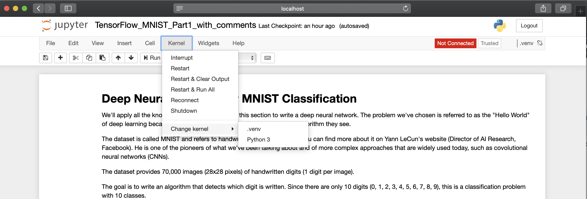

# How to install and configure Jupyter

This README describes how to setup `Jupyter` in your virtual environment.


## Install Jupyter

Under the root folder of your project, run the `add_venv.sh` `bash` script:

```shell
./add_venv.sh
```

This script creates the `.venv` folder that contains the `python` packages dedicated to your environment. Then, activate your virtual environment by typing:

```shell
source ./.venv/bin/activate
```

Then, you can install `Jupyter` by typing:

```shell
pip install --upgrade ipykernel
```

Finally, you need now to reference your virtual environment to `Jupyter` by typing:

```shell
python -m ipykernel install --user --name=.venv
```

From now on, your virtual environement is in the list of the available `Jupyter` kernels.


## Setup Jupyter

Start `Jupyter` by typing the following command from your virtual environment:

```shell
jupyter notebook
```

When `Jupyter` is up and running in your browser, start a project (a .ipynb file). Then select your virtual environment as the `Jupyter` kernel like this:




That's all!
