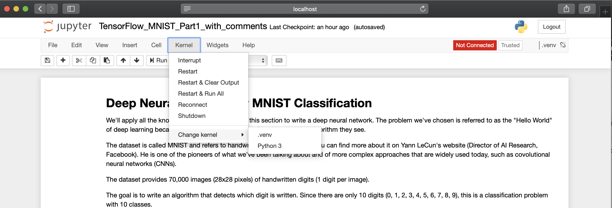

# How to install and configure Jupyter

This README describes how to setup `Jupyter` in your virtual environment.

Nota:
The default script `configure.sh` does this automatically for you.


## Install Jupyter

First you need to create a virutal environment (read README_BUILD_TEST.md). Then, you can install `Jupyter` by typing:

```shell
pip install --upgrade jupyter ipykernel
```

Finally, you need now to reference your virtual environment to `Jupyter` by typing:

```shell
python -m ipykernel install --user --name=.venv
```

From now on, your virtual environement is in the list of the available `Jupyter` kernels.


## Setup Jupyter

Start `Jupyter` by typing the following command from your virtual environment:

```shell
jupyter notebook
```

When `Jupyter` is up and running in your browser, start a project (a .ipynb file). Then select your virtual environment as the `Jupyter` kernel like this:




That's all!
